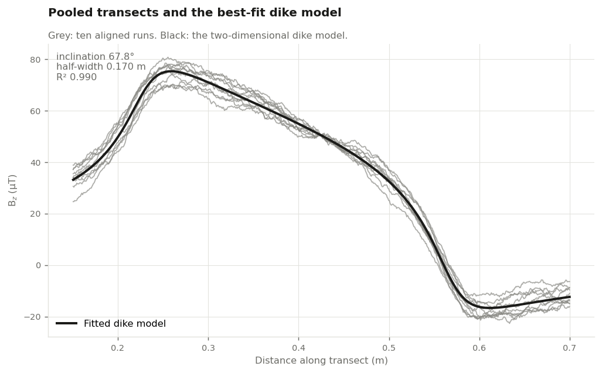
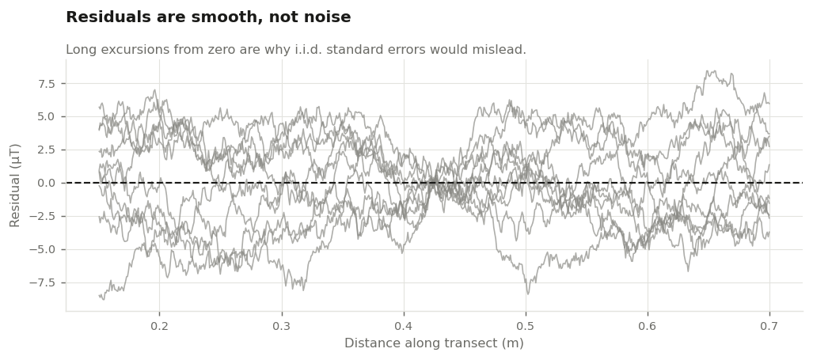
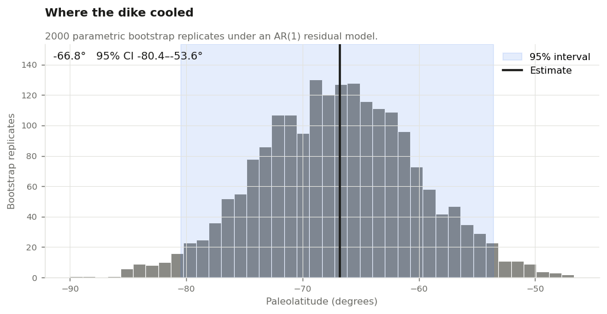
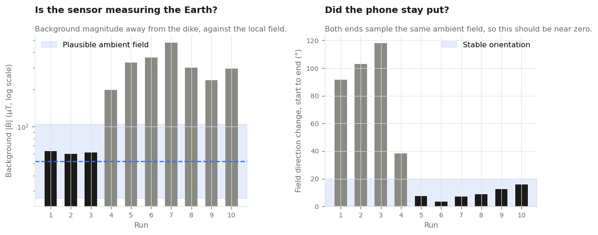

# Paleolatitude of a basalt dike from a phone magnetometer

**Where on Earth was this rock when it cooled?**

A basalt dike in the Middlesex Fells, north of Boston, was intruded as molten
rock and then froze. On the way through the Curie temperature its magnetic
minerals locked in the direction of the Earth's field at that moment. The
steepness of that direction — the *inclination* — records latitude: the field
lies flat at the equator and points straight down at the pole.

This repository recovers that angle from ten transects walked across the dike
with a phone magnetometer, and turns it into a paleolatitude with an uncertainty
that respects how the measurement was actually made.



## Result

| | |
|---|---|
| Magnetic inclination | **77.9°** (95% CI 69.8 – 85.2°) |
| Implied paleolatitude | **66.8°** (95% CI 53.6 – 80.4°) |
| Dike half-width | 0.229 m |
| Sensor height above the dike | 0.026 m |
| R² | 0.935 |

Reported as magnitudes. The sign of the inclination — and so which hemisphere
the dike cooled in — depends on the sensor's z-axis convention, which these
files do not record. The implied paleolatitude should be read as what the model
gives, not as a claim about where the rock was; see [Caveats](#caveats).

## The measurement

Ten traverses, each 0.8 m long, perpendicular to the strike of the dike, walked
to a metronome at 120 bpm so that time maps linearly onto distance. The phone
records the three field components at 100 Hz; the vertical component `Bz` is the
one modelled here.

Ten runs rather than one because a single pass over a rock with a hand-held
sensor is not a measurement — it is an anecdote.

## The method

**1. Time to distance.** Elapsed time is mapped linearly onto the traverse.

**2. Crop and align.** The ends of each run are contaminated by starting and
stopping, so they are trimmed to 0.15–0.70 m. Each run also carries its own
unknown DC offset, so the runs are shifted onto a common level, anchored at the
midpoint where the metronome beat makes position best known across runs.

**3. Fit the dike model.** The vertical anomaly over a two-dimensional dike has
a closed form: a *symmetric* pair of arctangent terms scaled by `sin(φ)`, and an
*antisymmetric* logarithmic term scaled by `cos(φ)`. The balance between the
symmetric and antisymmetric shape of the observed profile is what fixes the
inclination.

**4. Model the residuals.** The residuals are not noise — they wander in long
smooth excursions, because consecutive samples are a hundredth of a second and a
few millimetres apart. An AR(1) model fitted to them returns a coefficient of
0.993.



**5. Bootstrap the uncertainty.** With correlation that strong, `curve_fit`'s
standard error of 0.21° on the inclination is not believable — it assumes
thousands of independent observations when the effective number is far smaller.
Instead, 2000 synthetic profiles are built from the fitted model plus simulated
AR(1) residuals, each is refitted, and the spread of those refits is the
uncertainty. It comes out near 3°, about twenty times the naive figure. That
interval is then carried through the dipole relation `tan(I) = 2 tan(λ)`.



## Running it

```bash
pip install -r requirements.txt

python -m dike.run --data data/high_50cm     # the field data, included
python -m dike.run --synthetic               # simulated data with a known answer
pytest                                       # 39 tests
```

`notebooks/analysis.ipynb` walks through the same analysis with commentary.

## Checking that the pipeline is right

There is no independent measurement of this dike to check against, so
correctness is established on simulated transects instead: a known dike, a known
inclination, correlated noise, and a different unknown offset on every run.
`python -m dike.run --synthetic` recovers an inclination of 67.8° against a true
68.0°, and a half-width of 0.170 m against a true 0.170 m, with the bootstrap
interval bracketing the truth. `dike/synthetic.py` generates it.

## Two things worth knowing about the fit

**The parameterisation is degenerate, and the degeneracy flips the answer.**
A sensor at height *+z* above a dike inclined *−φ* produces exactly the same
profile as a sensor at *−z* above a dike inclined *+φ* — not approximately, but
to machine precision. An unconstrained fit will happily return a negative sensor
height, which reads as a perfectly good fit while silently reversing the sign of
the inclination. `fit_dike` therefore bounds the geometry to stay physical:
positive depth, positive half-width, the dike centre inside the surveyed window,
and the half-width no wider than the ground actually walked.

**The background level is not always identifiable.** The dike formula has no
constant term. When a traverse extends far enough past the dike that the profile
flattens on both sides, the background is pinned by those flanks and fitting it
removes a real bias — on simulated data, omitting it costs about six degrees.
When the traverse does not extend that far, as here, the background trades off
against the anomaly's own width and amplitude and the fit slides the dike centre
to the edge of the window. So `fit_baseline` is off by default, and the
alignment step sets the level instead.

## Data quality

The survey has problems that the fit cannot see, so `dike.diagnostics` checks
for them directly: whether the background field magnitude is near the local
geomagnetic field, and whether the field direction agrees between the two ends
of a traverse — both ends sample the same ambient field, so it should.



Runs 1–3 read a plausible ambient field but show 90–118° of direction change
across the traverse. Runs 4–10 hold their orientation but read four to nine
times the Earth's field. A constant sensor offset shifts `Bz` by a constant and
is removed by the alignment step, so the second failure is largely survivable;
the first is a real limit on how much the direction information can be trusted.
Dropping the glitched run 4 moves the inclination by 0.3°.

## Caveats

* **The hemisphere is not determined here.** A phone's +z axis points out of the
  screen, while geophysics takes +z as down. Which convention applies to these
  files is not recorded in them, and it flips the sign of the inclination. The
  magnitude is what the data constrains.
* **This cannot separate remanent from induced magnetisation.** An in-situ
  survey measures the sum of two things: the ancient remanence locked in when
  the rock cooled, and the magnetisation induced in it by today's field.
  Separating them needs oriented samples and stepwise demagnetisation in a
  laboratory. The fitted inclination of 77.9° sits closer to the present-day
  field inclination at this site — roughly 66° — than to the paleolatitude that
  published reconstructions give for eastern Massachusetts at any plausible age
  for this dike. The honest reading is that this measures a magnetisation
  direction, and that the induced part is likely to dominate.
* **One dike records an instant, not an average.** The dipole relation assumes
  the field averaged over enough time. A single intrusion does not average out
  secular variation, so this is a point estimate from one sample of the field.
* **The bootstrap covers fit uncertainty, not every error.** It says nothing
  about error in the distance calibration, or in the assumption that the dike is
  two-dimensional and vertically sided.
* **A phone magnetometer has unknown absolute calibration**, which is why only
  the direction is interpreted and never the intensity.

## Scope

This covers the upper dike at the 50 cm transect, where ten repeat runs were
recorded — my portion of a larger group survey that also covered a lower dike
and further transects along strike.

## Notes on authorship

The transect-alignment helpers and parts of the bootstrap loop were drafted with
AI assistance and then checked against hand-worked cases. The experimental
design, the physical model, and the interpretation are my own.

Field data collected September 2025, Middlesex Fells, Massachusetts.
